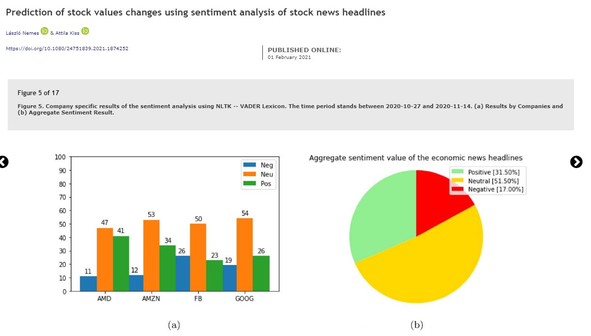
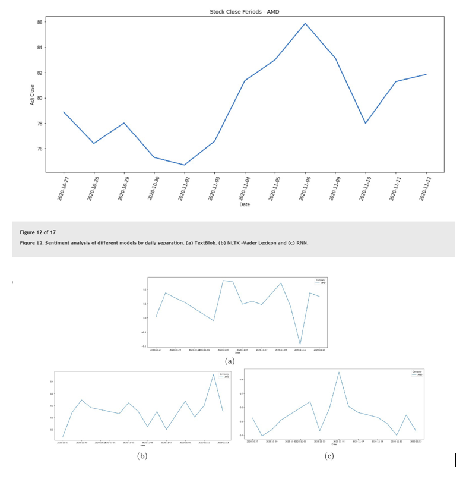
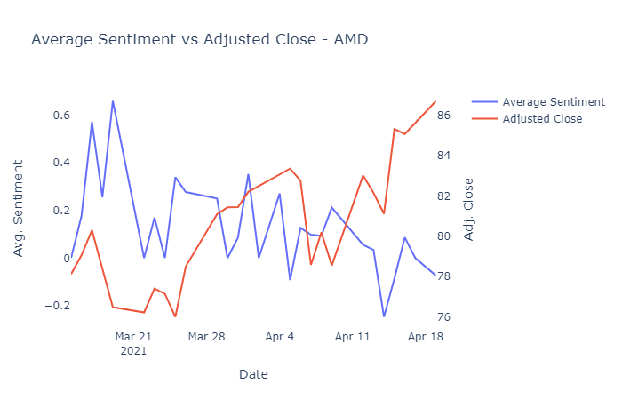

# Financial News Headline Sentiment Analysis

_Author: Michael Wu, April 2021_

##**Task 3 - NLP Tasks**

As mentioned in the overview of this investigation, we will perform 2 NLP tasks. The first NLP task is to perform sentiment analysis on news headlines for those 10 sampled companies. The second NLP task is to perform semantic analysis and extract keywords that contribute to the sentiment of each news headline.

####_Brief literature review_

Sentiment analysis on financial news related to listed companies and analysis on its relationship with the companies’ stock price movement is not a new area of study, many researches have been done by academics on this topic. For example, in a paper by [Wan et al. (2021)](https://www.nature.com/articles/s41598-021-82338-6), the authors applied NLP techniques to understand news sentiment of 87 companies for a period 7 years, and investigated the propagation of such sentiment in company networks and evaluate the associated market movements in stock price and volatility. They have found that there exists a weak but statistically significant association between strong media sentiment and abnormal market return as well as volatility. In another paper by [Nemes and Kiss (2021)](https://www.tandfonline.com/doi/full/10.1080/24751839.2021.1874252), the authors applied different techniques to the sentiment analysis of economic news headlines about the companies, and found that the BERT and RNN techniques were much more accurate than say VADER or TextBlob. The authors also established the moment of the change occurred in the stock values with sentiment analysis of economic news headlines. In addition to the academic findings around relationship between financial news sentiment of a company and its share price movement, we have found research paper that suggests news sentiment to be used as a company risk indicator. A paper by [Forss and Sarlin (2018)](https://arxiv.org/ftp/arxiv/papers/1706/1706.05812.pdf) found that by extracting the relative sentiment for companies to get a measure of individual company risk and input into a risk model together with co-occurrences of companies extracted from news on a quarterly basis, they were able to show that the highest quarterly risk value outputted by the risk model is correlated to a higher chance of stock price decline up to 70 days after quarterly risk measurement.

In terms of our second NLP task of performing semantic analysis and extracting keywords that contribute to the sentiment of each news headline, we have found an academic paper by [Ahuja et al. (2019)](https://www.sciencedirect.com/science/article/pii/S1877050919306593), whereby they have determined that by using TF-IDF technique to identify keywords of a text corpus, the sentiment analysis result was 3% to 4% higher than using other techniques such as N-gram features, as TF-IDF treats each word equally important.

####_Rationale for selection of the NLP task_

The reason we chose to perform a sentiment analysis using NLP techniques on financial news headlines is because it directly related to our “big picture” outlined in the objective of this investigation. We hypothesised that it is possible to have a sense of how a company’s share price or how the stock market will go based on news sentiment around the world, and we believed that news sentiment towards one company can indicate its own market performance. Therefore, performing a sentiment analysis using NLP techniques is the fundamental step for us to test this hypothesis. Furthermore, as discussed in the brief literature review above, financial news sentiment analysis have been reviewed by academics such as Wan et al., Nemes and Kiss, albeit with larger sample size of companies and over a long period of time. Their researches have confirmed the hypothesis, and thus we intend to replicate a similar technique on a smaller sample size of companies.

In terms of the second NLP task of performing a semantic analysis and extract keywords that contribute to the news sentiment, this is more an extension to the first NLP task, as we are interested to identify keywords from news headlines that determine the news sentiment, whether it is positive or negative. By identifying the keywords behind the sentiments, it can help financial news agencies to create news headlines that are worded in a more “sharp and eye-catching” way, and can help investors narrow down words that are important in a financial news headlines, and potentially make quicker informed decision on trades and obtain better stock performance in the short term.

####_Data pre-processing_

Before we conduct the NLP tasks, we performed data pre-processing on the text corpus. We do so by parsing the news corpus to a function called “preprocess_news_text” and perform lemmatisation on the news corpus using the WordNetLemmatizer function from the nltk.stem package. We first convert the news corpus to lower case and remove any non-English characters from the news corpus such as punctuations and symbols. We then tokenised each word in the news corpus using the nltk.word_tokenize function and created a list of word for us to loop through each word and lemmatise it using the WordNetLemmatizer function. We also ensured that the word in the list of words is not in the list of English stop words by using the stopwords function from the nltk.corpus package. This function will then create a new column called “news_cleaned” in the df_news dataframe.

````python
from nltk.corpus import stopwords
from nltk.tokenize import word_tokenize
from nltk.stem import WordNetLemmatizer

stop_words = set(stopwords.words('english'))

# function to pre-process news
def preprocess_news_text(news):
    # initialise lemmatizer
    wordnet_lemmatizer = WordNetLemmatizer()

    news = news.lower()

    # remove punctuations
    news = re.sub('[^a-zA-Z]', ' ', news)

    # remove stopwords and lemmatization
    news_words = word_tokenize(news)
    news_words = [wordnet_lemmatizer.lemmatize(word) for word in news_words if word not in stop_words]

    news_lemmed = ' '.join(news_words)
    return news_lemmed

df_news['news_cleaned'] = df_news['text'].apply(preprocess_news_text)
````
There is no data pre-processing for the second NLP task as it is using the same “news_cleaned” column from df_news dataframe to perform keyword extraction.

####_Hyperparameter_

With the first NLP task of performing sentiment analysis on news headlines, we used the SentimentIntensityAnalyzer object from the VADER package and applied its polarity_scores function on the “news_cleaned” column from df_news dataframe. This generated the positive score, negative score, neutral score, and compound columns for each news headline, which we then join with the df_news dataframe to create a new dataframe called df_news_sentiment. No hyperparameters were used when performing this NLP task, as we were able to perform this NLP task using the standard setting from the VADER package.

````python
from nltk.sentiment.vader import SentimentIntensityAnalyzer
import pandas as pd

# NLP task 1 - sentiment analysis
sid = SentimentIntensityAnalyzer()

sentiment = df_news.apply(lambda r: sid.polarity_scores(r['news_cleaned']), axis=1)
df_sent = pd.DataFrame(list(sentiment))
df_news_sentiment = df_news[['ticker', 'date', 'time', 'text', 'news_cleaned']].join(df_sent)


def get_sentiment(compound):
    if compound < 0:
        return "Negative"
    elif compound == 0:
        return "Neutral"
    else:
        return "Positive"


df_news_sentiment['sentiment'] = df_news_sentiment['compound'].apply(get_sentiment)
````

In terms of the second NLP task where we extract keywords that contribute to the sentiments for each news headline, we used the TfidfVectorizer object from the sklearn.feature_extraction.text package and applied its fit_transform function on the “news_cleaned” column from df_news dataframe. This generated vectors containing TF-IDF scores for each word for each news headline in the news corpus. We then performed the following steps to extract the keywords for each news headlines. Again, no hyperparameters were used when performing this NLP task.

- Loop through each news headline in the news corpus
- For all words in the corpus, store the score for each word in a dictionary
- Remove words that have 0 score (i.e. not important), sort the dictionary, and then add each dictionary of keywords into a list called keywords_list
- Loop through the keywords_list and convert the key-value pair of each dictionary in the list into a long string, and then append the string to another list called keyword
- Lastly, convert the keyword list into a pandas dataframe, so that the dataframe will only have one column called keyword that contains the keyword and the corresponding score for each index in the news corpus, i.e. for each news headline

````python
# NLP task 2 - information extraction (keyword extraction)
import pandas as pd
import datetime
from tqdm import tqdm
from sklearn.feature_extraction.text import TfidfVectorizer

news_corpus = df_news_sentiment['news_cleaned']


# function using TfidfVectorizer to find keywords based on TFIDF score for each news headline in the news_corpus
def extract_keywords(news_corpus):
    vectorizer = TfidfVectorizer(use_idf=True)
    news_vectors = vectorizer.fit_transform(news_corpus)

    keyword_dict = {}
    keywords_list = []
    keyword = []

    # loop through each news headline in the corpus
    for index in tqdm(range(len(news_corpus))):
        vector = news_vectors[index]

        # for all words in the corpus store the score for each word in a dictionary
        for i in range(len(vectorizer.get_feature_names())):
            keyword_dict[vectorizer.get_feature_names()[i]] = round(vector.T.todense()[i].tolist()[0][0], 4)

        # remove words that have 0 score (i.e. not important), sort the dictionary, and add each dictionary of
        # keywords into the list
        keyword_dict = {k: v for k, v in keyword_dict.items() if v != 0.0}
        keyword_dict_sorted = sorted(keyword_dict.items(), key=lambda x: x[1], reverse=True)
        keywords_list.append(keyword_dict_sorted)

    # loop through the keywords_list and convert key and value of each dictionary in the list into a massive string,
    # then append it to a list called keyword.
    for i in range(len(keywords_list)):
        k = ', '.join([item[0] + ": " + str(item[1]) for item in keywords_list[i]])
        keyword.append(k)

    # convert the keyword list into a Pandas dataframe, so that the df will only have one column called keyword,
    # and contains the keyword and the corresponding score for each index in the news_corpus.
    df_keyword = pd.DataFrame(keyword, columns=['keyword'])

    return df_keyword


start_time = datetime.datetime.now()
df_keyword = extract_keywords(news_corpus)
end_time = datetime.datetime.now()

print("Extracting keywords for the news corpus took " + str(end_time - start_time) + " seconds")

df_sentiment_keyword = pd.concat([df_news_sentiment, df_keyword], axis=1)
````

####_Preliminary assessment of NLP task performance_

Once we performed our NLP tasks, we performed a preliminary assessment of our NLP task performance against those that were done by academics on a larger scale or dataset. We first compared our results against the paper by [Nemes and Kiss (2021)](https://www.tandfonline.com/doi/full/10.1080/24751839.2021.1874252), whereby the author also used the VADER package from NLTK to perform sentiment analysis on news headlines obtained from FINVIZ for companies: AMD, AMZN, FB, and GOOG. The author found that for their sampled period between 2020-10-27 and 2020-11-14, there were more neutral news sentiments for sampled companies than positive and negative combined, see screenshot below.



Whereas for our investigation, for the sampled period between 2021-03-15 and 2021-04-19, we have more positive news sentiments than neutral. Although our sampled period and sampled company size is different to that of the academic paper, one interesting result is that both analysis have found lower amount of negative news sentiments, with ours and the academic paper’s being roughly 17% of the total population. Refer to screenshot for the distribution of news sentiments from our investigation.

````python
import plotly.graph_objects as go

# function to plot sentiment distribution
def plot_sentiment_dist(positive, negative, neutral):
    labels = ['[positive]', '[negative]', '[neutral]']
    fig = go.Figure(data=[go.Pie(labels=labels, values=[positive, negative, neutral], textinfo='label+percent',
                                 insidetextorientation='radial')])
    fig.show()
````


Furthermore, in the academic paper by Nemes and Kiss, they have determined that financial news do have an impact on stock market shifts, whereby there were times when certain news items have effect to the later movements, and there were times when the news describe a particular shift will enhance stock price changes too. The authors plotted the AMD stock market changes during the study period against the results of different sentiment models. The plot supported the conclusion made by the authors above, see below.



In our investigation for our study period, we did observe a similar trend in the relationship between news sentiment for AMD and its stock price movement at the start of the study period. However, towards the end of study period, the correlation is more negative. This could be due to the limitation around the sentiment analysis technique used in our investigation. See screenshot below.
````python
import plotly.graph_objects as go
from plotly.subplots import make_subplots

# top 10 tech stocks in US, most of them would have been impacted during Covid one way or another
tickers = ['AMZN', 'AAPL', 'MSFT', 'INTC', 'AMD', 'DIS', 'NFLX', 'FB', 'TWTR', 'GOOG']

# last part - plot sentiment score vs stock price
def fig_plot(df_plot, ticker):
    fig = make_subplots(specs=[[{"secondary_y": True}]]) \
        .add_trace(
        go.Scatter(x=df_plot['date'], y=df_plot['compound'], name="Average Sentiment"),
        secondary_y=False,
    ) \
        .add_trace(
        go.Scatter(x=df_plot['date'], y=df_plot['Adj Close'], name="Adjusted Close"),
        secondary_y=True,
    ) \
        .update_layout(
        title_text="Average Sentiment vs Adjusted Close - " + ticker,
        plot_bgcolor='rgba(0,0,0,0)'
    ) \
        .update_xaxes(title_text="Date") \
        .update_yaxes(title_text="Avg. Sentiment", secondary_y=False) \
        .update_yaxes(title_text="Adj. Close", secondary_y=True)

    fig.show()


for ticker in tickers:
    df_sent = df_news_sentiment[df_news_sentiment['ticker'] == ticker][['ticker', 'date', 'compound']]
    df_sent_avg = df_sent.groupby('date').agg({"compound": "mean"}).reset_index()
    df_hist_price = df_hist_price_mod[(df_hist_price_mod['Ticker'] == ticker) &
                                      (df_hist_price_mod['Date'].isin(df_sent_avg['date']))][
        ['Ticker', 'Date', 'Adj Close']]

    df_plot = pd.merge(df_sent_avg, df_hist_price, left_on='date', right_on='Date', how="left") \
        .drop(columns=['Date']) \
        .fillna({'Ticker': ticker}) \
        .set_index('date') \
        .interpolate(method="time") \
        .reset_index()

    fig_plot(df_plot, ticker)
````


Please refer to main.py for the full set of python codes. <br>


##**References**

1.	Wan, X., Yang, J., Marinov, S. et al. Sentiment correlation in financial news networks and associated market movements. Sci Rep 11, 3062 (2021). https://doi.org/10.1038/s41598-021-82338-6
2.	Nemes, L., & Kiss, A. (2021). Prediction of stock values changes using sentiment analysis of stock news headlines. Journal of Information and Telecommunication, 1–20. https://doi.org/10.1080/24751839.2021.1874252
3.	Forss, T., & Sarlin, P. (2018). News-sentiment networks as a company risk indicator. Journal Of Network Theory In Finance, 4(1), 65–86. https://doi.org/10.21314/jntf.2018.039
4.	Ahuja, R., Chug, A., Kohli, S., Gupta, S., & Ahuja, P. (2019). The Impact of Features Extraction on the Sentiment Analysis. Procedia Computer Science, 152, 341–348. https://doi.org/10.1016/j.procs.2019.05.008
