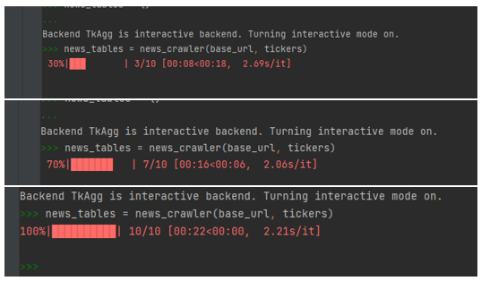

# Financial News Headline Sentiment Analysis

_Author: Michael Wu, April 2021_

##**Task 2 - WebCrawler**

###<u>Part 1</u>

####_Websites to be consumed_

To perform sentiment analysis on news headlines and identify any relationship between news sentiment and share price of a company, we need to first obtain the news headlines. We used a website called [FINVIZ](https://finviz.com/) as the source for news headlines of our sampled companies. For the scope of this investigation, we selected the top 10 technology listed companies in US, they are:

|**Company Name**            | **Ticker**|
|----------------------------|:---------:|
|Amazon.com, Inc.            |AMZN       |
|Apple Inc.                  |AAPL       |
|Microsoft Corporation       |MSFT       |
|Intel Corporation           |INTC       |
|Advanced Micro Devices, Inc.|AMD       |
|The Walt Disney Company     |DIS       |
|Netflix, Inc.               |NFLX       |
|Facebook, Inc.              |FB       |
|Twitter, Inc.               |TWTR       |
|Alphabet Inc.               |GOOG       |

####_A rationale for extracting the web content_

The website FINVIZ is used because it is a browser-based stock market research platform that makes market information easily accessible to traders and investors. The platform includes a news feed that provides the latest financial news that can help in choosing stocks and making decisions on whether to enter or exit a trade. The news headlines are sourced from some of the leading news providers, such as Bloomberg, MarketWatch, the New York Times, and CNBC and so on. Essentially this website is a centralised repository of news headlines for a company, and thus extracting news headlines from this website is the fundamental step required for us to achieve the objective of this investigation and to perform sentiment analysis on news headlines for the sampled companies.

####_Content coverage of the data extracted_

As mentioned above, this webcrawler will extract news headlines from FINVIZ for the sampled companies. Below is a screenshot of how the website is structured and the location of the news headlines section for each company.


####_Complexity of the content layout_

The html content layout for this website is fairly straight forward for a webcrawler to scrape. The news headlines section of a company is wrapped inside a table class with the id of “news-table”, and each headline is bounded by the `<tr>` `</tr>` tags. Within this tag, the date and time data is between the first `<td>` `</td>` tags, and the news headline text is in the `<a>` `</a>` tags. Refer to screenshot below when inspecting the html of the website.


####_Website / data copyright considerations_

Lastly, before we start scraping news headlines from FINVIZ, we confirmed there is no copyright limitation based on the privacy section of the website.

####_Content extractor to export the important aspects of the data_

With the simple html structure of the news headlines table, we utilised the BeautifulSoup package to scrape the html class containing the ‘news-table’ tag. We created a function called “news_crawler” that takes in the base_url and the list of tickers - 10 companies mentioned above - as parameters. The function then go through each ticker in the list, open the relevant html address and look for the ‘news-table’ class. The function then stores the result in a dictionary called “news_tables”, with the key of the dictionary being the ticker code and the corresponding value for each key being the “news_table” read for each ticker using the BeautifulSoup package. Refer to following for the python code for the “news_crawler” function.

````python
# function to extract news for stock ticker
from urllib.request import urlopen, Request
from bs4 import BeautifulSoup
from tqdm import tqdm

def news_crawler(base_url, tickers):
    news_tables = {}

    for ticker in tqdm(tickers):
        url = base_url + ticker

        req = Request(url=url, headers={'user-agent': 'my-scraper/0.1'})
        response = urlopen(req)
        html = BeautifulSoup(response, 'lxml')

        news_table = html.find(id='news-table')
        news_tables[ticker] = news_table

    return news_tables
````

####_Demonstration of the application of the WebCrawler_

Below are screenshots demonstrating the news_crawler in action.



####_Methodology of processing, cleaning, and storing harvested data for NLP task_

Once we obtained the news_tables dictionary that contains all recent financial news headlines in html format for the corresponding sampled companies, we need to extract relevant information such as the ticker code, the date and time of the news headline, and the text of the news headline. To do so, we created a function called “extract_news” that takes in the news_tables dictionary as a parameter. The function then iterate through each news_table (i.e. each item of the news_tables dictionary) and then iterate through all `<tr>` tags in the news_table to extract the following information.

•	Text of the news headline from tag `<a>` <br>
•	Date and time of the news headline from tag `<td>` <br>
•	Ticker code of the company


The function then creates a list to store key information of the news headline, and returns a list of list called “extracted_news”, which contains a list of key information for each news headline. We then converted resultant list into a pandas dataframe called “df_news” with the following columns.

•	Ticker  
•	Date    
•	Time    
•	Text

````python
import pandas as pd
from webcrawler import news_crawler

base_url = 'https://finviz.com/quote.ashx?t='

# top 10 tech stocks in US, most of them would have been impacted during Covid one way or another
tickers = ['AMZN', 'AAPL', 'MSFT', 'INTC', 'AMD', 'DIS', 'NFLX', 'FB', 'TWTR', 'GOOG']

news_tables = {}
# get news headlines
news_tables = news_crawler(base_url, tickers)

# extract news
def extract_news(news_tables):
    extracted_news = []

    for file_name, news_table in news_tables.items():
        # iterate through all <tr> tag in news_table
        for news in news_table.findAll('tr'):
            text = news.a.get_text()  # get text from tag <a>
            date_scrape = news.td.text.split()  # get date from tag <td>

            # if length of 'date_scrape' is 1, load 'time as the only element
            if len(date_scrape) == 1:
                time = date_scrape[0]
            # else load date as the first element and time as the second element
            else:
                date = date_scrape[0]
                time = date_scrape[1]

            ticker = file_name.split('_')[0]

            extracted_news.append([ticker, date, time, text])

    return extracted_news


extracted_news = extract_news(news_tables)

df_news = pd.DataFrame(extracted_news, columns=['ticker', 'date', 'time', 'text'])
````

Lastly, we converted the “Date” column from a string format to a datetime format, as we will need to use this “Date” column for subsetting in later stage of this investigation.

````python
import pandas as pd
import datetime

# function to convert string to datetime
def to_date(dates, date_format):
    date_list = dates.tolist()
    date_list_converted = []
    for date in date_list:
        date_con = datetime.datetime.strptime(date, date_format)
        date_list_converted.append(date_con)

    converted_dates = pd.Series(date_list_converted)
    return converted_dates


df_news['date'] = to_date(df_news['date'], '%b-%d-%y')
list_of_dates = df_news['date'].unique()
````

####_Summary and visualisation of the harvested data_

We then performed an exploratory data analysis on the news dataframe and determined that a total of 1000 news headlines for the sampled companies were scraped. We also determined that the distribution of the word length of the corpus document is relatively normal, based on the frequency distribution plot of the number of words in each news corpus.
````python
import matplotlib.pyplot as plt

# quick insights on news headlines gathered
num_news_gathered = len(df_news)

df_news['word_length'] = [len(word) for word in df_news['text']]
x = df_news['word_length']
plt.hist(x)

````


###<u>Part 2</u>

####_Websites to be consumed_

Another webcrawler was developed as a supplementary to the first webcrawler above. As part of the investigation, we also wanted to identify if there is any relationship between news sentiment and share price, and so we need to obtain historical share price for those sampled companies. We used the [Yahoo Finance](https://finance.yahoo.com/) as the source for historical share price.

####_A rationale for extracting the web content_

Yahoo Finance is used because it is a free website that contains historical share price information of any listed companies. For our investigation into the relationship between news sentiment and historical share price, a website that contains reliable and easily accessible historical share price is required for us to achieve the object, and Yahoo Finance provides the capability for us to do so.

####_Content coverage of the data extracted_

Yahoo Finance contains many financial information of a company, one of which is the historical data. The historical data section is a tab on a webpage, and the website is structured per the screenshot below.


####_Complexity of the content layout_

The html content layout for Yahoo Finance is slightly complicated than FINVIZ above, as we need to click the website 3 times to get to the historical data page.

1.	Input the ticker code <br>
2.	Click the search button <br>
3.	Click the “Historical Data” tab to navigate to the historical data page

Once we navigated to the historical data page of a company, the historical data table is wrapped in a html tag called “table”, and each daily share price is bounded by the `<tr>` `</tr>` tags. Refer to screenshot below when inspecting the html.


####_Website / data copyright considerations_

Lastly, before we start scraping historical share price data from Yahoo Finance, we confirmed there is no copyright limitation based on the privacy section of the website.

####_Content extractor to export the important aspects of the data and methodology of data processing_

To scrape the historical share price from Yahoo Finance, we utilised the Selenium package and created a Chrome webdriver. We created a function called “historical_price” that takes in the url and the list of tickers (10 companies mentioned above) as parameters. The function first initialise the Chrome webdriver, and then for each ticker in the list of tickers, the webdriver will perform the following steps:

1.	Open Yahoo Finance
2.	Enter the ticker into the search box
3.	Click the search button
4.	Click on “Historical Data” tab
5.	Scroll down the webpage
6.	Saves the webdriver page source into a local variable called webpage

Once the webpage is obtained through the Selenium webdriver, we again used the BeautifulSoup package to scrape the html object to find the “table” for historical price and the daily share price. Then for each daily share price, we look for all values within the `<td>` tag, and extract the following key information by scraping the `<span>` tag within the `<td>` tag. We saved the extracted information into a dictionary called “row_dict”, in which each key-value pair within the dictionary is the below key information of a company for a given date.

- Ticker
- Date
- Open
- High
- Low
- Close
- Adj Close
- Volume

After storing key information into “row_dict”, we append the dictionary into a list called “historical_price_data”. We then repeat this process for the next ticker and so on, until all tickers have been scrapped. Lastly, the function returns a pandas dataframe called “df_hist_price”, which is created from the list of historical price.

````python
from bs4 import BeautifulSoup
from tqdm import tqdm
from selenium import webdriver
import time
import pandas as pd

# function to extract share price for a company for the last 7 days
def historical_price(url, tickers):
    # setting up chrome driver
    driver = webdriver.Chrome()

    historical_price_data = []

    # loop through the list of tickers
    for ticker in tqdm(tickers):
        driver.get(url)
        time.sleep(1)

        # Enter name of company in searchbox, and wait for 2 seconds
        driver.find_element_by_xpath("//input[@placeholder = 'Search for news, symbols or companies']").send_keys(
            ticker)
        time.sleep(2)

        # Click on Search icon and wait for 2 seconds
        driver.find_element_by_xpath("//button[@id= 'header-desktop-search-button']").click()
        time.sleep(2)

        # Driver clicks on Historical Data tab and sleeps for 5 seconds
        driver.find_element_by_xpath("//span[text() = 'Historical Data']").click()
        time.sleep(5)

        driver.execute_script("window.scrollBy(0,100)")
        time.sleep(2)

        webpage = driver.page_source
        time.sleep(5)

        # start scraping the historical price data
        htmlpage = BeautifulSoup(webpage, 'lxml')
        table = htmlpage.find('table', class_='W(100%) M(0)')
        rows = table.find_all('tr', class_='BdT Bdc($seperatorColor) Ta(end) Fz(s) Whs(nw)')

        for i in range(0, len(rows)):
            try:
                row_dict = {}
                values = rows[i].find_all('td')
                if len(values) == 7:
                    row_dict["Ticker"] = ticker
                    row_dict["Date"] = values[0].find('span').text.replace(',', '')
                    row_dict["Open"] = values[1].find('span').text.replace(',', '')
                    row_dict["High"] = values[2].find('span').text.replace(',', '')
                    row_dict["Low"] = values[3].find('span').text.replace(',', '')
                    row_dict["Close"] = values[4].find('span').text.replace(',', '')
                    row_dict["Adj Close"] = values[5].find('span').text.replace(',', '')
                    row_dict["Volume"] = values[6].find('span').text.replace(',', '')
                historical_price_data.append(row_dict)
            except:
                print("Row number: " + str(i))
            finally:
                i = i + 1

    driver.quit()
    df_hist_price = pd.DataFrame(historical_price_data)

    return df_hist_price
````

####_Demonstration of the application of the WebCrawler_

Below are screenshots demonstrating the historical_price webcrawler in action.


Since there is a limit on how many times we can scrape Yahoo Finance in one go, we split our list of tickers into 2 sets of 5 tickers (or 5 companies), such that the historical_price webcrawler will be called twice. Once both sets of tickers have been scraped, we concatenate both resultant dataframes together into one single dataframe. We then cleaned the dataframe by dropping and empty rows, converting all dollar value columns from string to numeric data type and date column to datetime. Lastly, we subset the historical price dataframe to just contain data for those dates that are common to the “df_news” dataframe. In other words, for a given company, the dates for the news headlines should be the same as its historical price for our investigation.

````python
from webcrawler import historical_price
import pandas as pd

yahoo_finance = 'https://finance.yahoo.com/'

# need to split the ticker list into 2 because yahoo finance has a limit on scraping in one session
tickers_list_1 = ['AMZN', 'AAPL', 'MSFT', 'INTC', 'AMD']
tickers_list_2 = ['DIS', 'NFLX', 'FB', 'TWTR', 'GOOG']

# get historical price
try:
    hist_price_1 = historical_price(yahoo_finance, tickers_list_1)
except AttributeError:
    hist_price_1 = historical_price(yahoo_finance, tickers_list_1)

try:
    hist_price_2 = historical_price(yahoo_finance, tickers_list_2)
except AttributeError:
    hist_price_2 = historical_price(yahoo_finance, tickers_list_2)

df_hist_price = pd.concat([hist_price_1, hist_price_2]) \
    .reset_index(drop=True) \
    .dropna()

cols = df_hist_price.columns.drop(['Ticker', 'Date'])
df_hist_price[cols] = df_hist_price[cols].apply(pd.to_numeric, errors='coerce')

df_hist_price['Date'] = to_date(df_hist_price['Date'], '%b %d %Y')
df_hist_price_mod = df_hist_price[df_hist_price['Date'].isin(list_of_dates)]
````

Please refer to main.py and webcrawler.py for the full set of python codes. 